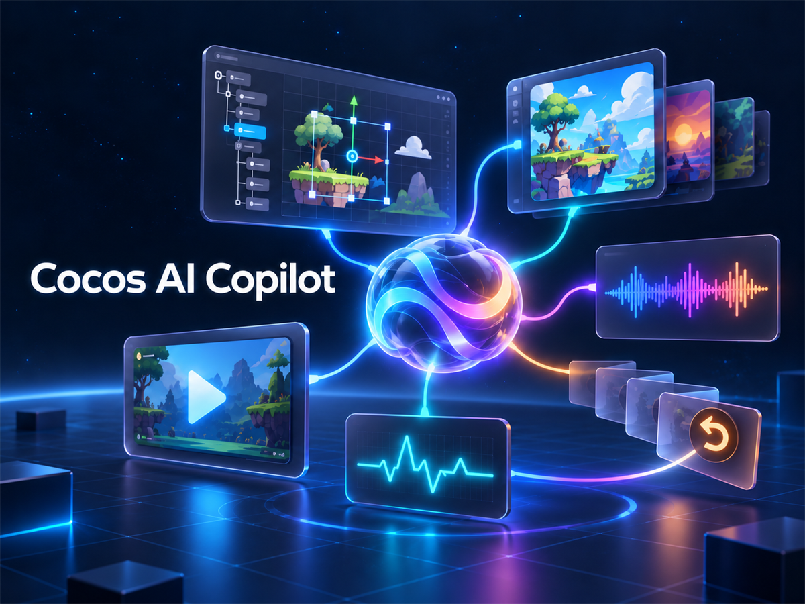
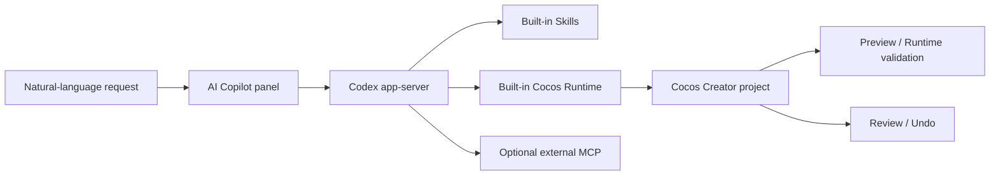

<p align="center">
  
</p>

<p align="center">
  <a href="README.md">简体中文</a> ｜ English
</p>

<h1 align="center">Cocos AI Copilot</h1>

<p align="center">
  Drive scenes, assets, and Preview / Runtime validation in Cocos Creator with natural language.
</p>

<p align="center">
  
  
  
  
  
</p>

Cocos AI Copilot is a dockable AI development assistant that runs inside Cocos Creator. Through Codex app-server and its built-in Cocos Runtime, it turns natural-language requests into inspectable Scene, Node, Component, asset, and Preview operations while keeping artifacts, execution history, project changes, and runtime evidence in the current project and conversation.

It is not a standalone game engine, and it does not replace Cocos Creator, version control, or human testing. Its purpose is to let AI work in the real Creator project context while keeping every important result reviewable, verifiable, and—when safety preconditions still hold—undoable.

## Contents

- [Core features](#core-features)
- [How it works](#how-it-works)
- [Requirements](#requirements)
- [Installation](#installation)
- [First use](#first-use)
- [Example prompts](#example-prompts)
- [Built-in Skills](#built-in-skills)
- [External MCP](#external-mcp)
- [Release integrity](#release-integrity)
- [Known limitations](#known-limitations)
- [Troubleshooting](#troubleshooting)
- [Documentation](#documentation)
- [License](#license)

## Core features

### Natural-language Cocos development

- Describe the goal directly inside Creator without leaving the project.
- Read the current project, Scene, Hierarchy, selection, and asset state.
- Invoke Cocos tools for the task and return structured results with an activity record.
- Persist conversations, attachments, queued messages, and mid-turn steering.

### Scene / Node / Component

- Inspect, create, open, and save Scenes.
- Find, create, modify, or delete Nodes.
- Update position, rotation, scale, and active state.
- Inspect, add, remove, and configure Components and their properties.
- Work with common UI, Prefab, asset-reference, and script-diagnostic flows.

### Image asset workflow

- Deliver generated images and image attachments as chat Artifact cards.
- Persist cards with the conversation so they remain visible after reopening it.
- Deduplicate identical image content so later inspection does not create duplicate cards.
- Crop, trim transparent borders, resize, pad, flip, rotate, adjust alpha and color, composite, and mask images.
- Work with Sprite Sheets, Nine-Slice, pixel-art filtering, AssetDB import, SpriteFrame configuration, and scene placement.
- Wait for confirmed ImageAsset / SpriteFrame readiness before binding or validating the asset.

### Audio asset workflow

- Present audio results as playable chat Artifact cards.
- Process WAV, MP3, and OGG with trimming, fades, gain, normalization, channel, and sample-rate controls.
- Save processed versions, import AudioClips, and create or configure AudioSources.
- Validate the Clip, volume, loop, and play-on-awake configuration in Preview.

### Preview / Runtime validation

- Start or reuse Cocos Creator Preview.
- Send session-bound keyboard, mouse, and touch input to the current Game View Preview.
- Read semantic runtime evidence such as Nodes, Components, game state, or visible text.
- Capture Preview screenshots when appearance is part of the acceptance criteria.

### Runtime Error Capture

- Capture `console.error` entries from the current Game View Preview session.
- Capture unhandled Promise rejections and uncaught exceptions.
- Preserve the message, stack, source file, line and column, occurrence count, and Preview session identity.
- Keep errors session-bound so an earlier Preview run is not mistaken for the current one.

### Review / Undo

- Review recorded file, asset, Scene, Node, and Component changes per turn.
- Locate affected targets and inspect semantic change summaries.
- Undo supported changes when their identity, hash, and safety preconditions still match.
- Report conflicts instead of silently overwriting newer manual or agent changes.

## How it works



A typical task follows this loop:

1. Read the project, Scene, and Hierarchy context.
2. Define the goal, constraints, and acceptance criteria.
3. Make the smallest coherent Scene, code, or asset change.
4. Read the result back and run Preview when needed.
5. Inspect Artifacts, Activity, Runtime errors, and Review.
6. Accept the result, use Undo where supported, or restore with version control.

## Requirements

| Item | 0.1.0 requirement |
| --- | --- |
| Cocos Creator | Officially verified and supported on `3.8.8` |
| Operating system | Accepted on `Windows x64` |
| Codex | Stable `0.160.1` or newer; the latest stable release is recommended |
| Codex connection | `app-server` |
| Model service | ChatGPT sign-in, or an OpenAI / DeepSeek API key |

The extension ZIP does not bundle Codex, model accounts, or API credentials. Version `0.160.1` is the minimum compatible and tested baseline—not a fixed pin. Newer stable Codex releases are allowed, but future versions are not automatically considered individually certified.

## Installation

### Install from a GitHub Release

1. Download the formal package from this repository's **Releases** page:

   ```text
   cocos-ai-copilot-0.1.0.zip
   ```

2. Close Cocos Creator for the target project.
3. If an older version is installed, completely remove:

   ```text
   <project>\extensions\cocos-ai-copilot
   ```

4. Extract the ZIP and place `extensions\cocos-ai-copilot` in the corresponding project directory.
5. Reopen the project and select **AI Copilot** from the top menu.
6. Open Settings → Cocos MCP → Details and confirm that the version is `0.1.0`.

> [!IMPORTANT]
> Do not overlay a new release on top of an old extension directory. Remove the old directory first, then perform a clean installation so stale files cannot leave the entry point or modules in an inconsistent state.

### Install from the Cocos Extension Store

Install **Cocos AI Copilot** from the Cocos Extension Store, then reopen the target project.

See the [installation guide](docs/INSTALLATION.md) (Chinese) for the complete procedure.

## First use

1. Open **AI Copilot → Settings → Runtime**.
2. Let the extension discover a compatible Codex installation. If discovery fails, select the Codex executable and test the connection manually.
3. Under **Model Services**, sign in with ChatGPT or configure and verify an OpenAI / DeepSeek API key.
4. Under **Cocos MCP**, confirm that the built-in Runtime is connected, Tools are available, and `4 / 4 Skills` are ready.
5. Start a new conversation. Ask Copilot to read the current Scene / Hierarchy before describing the requested change, protected areas, and acceptance criteria.
6. When the task finishes, inspect chat Artifacts, Preview / Runtime evidence, and Review. Use Undo only when appropriate.

See the [first-use guide](docs/FIRST_USE.md) (Chinese) for more detail.

## Example prompts

### Read-only project orientation

> Read the current Scene, Hierarchy, and selected Node. Summarize the existing UI structure without modifying anything.

### Scene / Component work

> Add a Button named StartButton under the current Canvas without changing the existing hierarchy. Read back the Button and Component properties, then validate its appearance and click behavior in Game View Preview.

### Image assets

> Deliver the character images generated in this turn as chat image Artifacts. Import the selected final image into `assets/Art`, wait for its SpriteFrame to become ready, and place it under the current Canvas. Do not register duplicate cards for the same image. Validate the result with Preview and a screenshot.

### Audio assets

> Trim this background track to the requested range, add fade-in and fade-out, and save a new version. Import it, configure an AudioSource with loop enabled and volume set to 0.3, then read the actual runtime configuration in Preview.

### Runtime error diagnosis

> Read Runtime errors from the current Game View Preview session. Group them by source file, line, stack, and occurrence count. Diagnose first; do not modify the project yet.

## Built-in Skills

Version 0.1.0 includes these Built-in Skills:

| Skill | Revision | Purpose |
| --- | ---: | --- |
| Cocos MCP Workflow | 6 | Main project inspection, modification, asset, and validation workflow |
| UI Composition | 4 | Cocos UI, layout, adaptation, Prefab, and interaction workflow |
| 2D Image Toolkit | 2 | Image processing, import, SpriteFrame, slicing, and scene placement |
| Preview Debug | 4 | Game View input, runtime validation, and error diagnosis |

The extension installs these Skills as part of the current project's capability chain; it does not rely on temporary Skill files from a development machine.

## External MCP

The settings panel can manage:

- local stdio MCP services;
- remote HTTP MCP services;
- automatic Node.js discovery with a manual fallback for JavaScript services;
- target application, working directory, environment variables, and additional arguments.

Installation, authorization, security, and availability of external MCP services remain the responsibility of those services and the user's environment.

## Release integrity

The formal Cocos AI Copilot `0.1.0` package uses the exact bytes accepted on a second clean computer. It was not rebuilt or repackaged; only `-rc` was removed from the filename.

| File | Size | SHA256 |
| --- | ---: | --- |
| `cocos-ai-copilot-0.1.0.zip` | `2,248,843 bytes` | `38121A724018D93F95CB4A0E5FC03DF6B193FF8F1CFF140E87CE22B4919B3426` |

The file size and SHA256 are identical before and after the rename.

## Known limitations

- Version `0.1.0` has not been formally certified on other Cocos Creator versions, macOS, or Linux.
- Codex prerelease builds are outside the current compatibility policy. Newer stable builds may connect, but they are not automatically individually certified.
- Runtime Error Capture is primarily scoped to the current Creator Game View Preview session. It does not replace complete logging validation in browser, simulator, or native builds.
- Review / Undo only covers recorded, supported changes whose identity and safety preconditions still match. It does not replace Git or another version-control system.
- Automated input, state reads, and screenshots prove only the corresponding actions and observations. They do not replace a complete human playtest, device-compatibility pass, or release acceptance.
- Image, audio, and model-output quality, rights, and service availability depend on the selected model, input, and external services. Review all content before release.
- The extension does not guarantee permissions or stability of third-party MCP services.

## Troubleshooting

### Runtime cannot find Codex

Confirm that stable Codex `0.160.1` or newer is installed. Recheck under Settings → Runtime. If a manual path was saved previously, select **Restore automatic detection** or choose the current Codex executable again.

### A module or entry file is missing after installation

Close Creator, completely remove `<project>\extensions\cocos-ai-copilot`, and perform a clean installation from the same formal ZIP. Do not overlay the old directory.

### Cocos MCP looks healthy, but the current conversation has no Cocos Tools

Confirm that the Runtime is connected under Settings → Cocos MCP, then start a new conversation and read the Scene / Hierarchy. A local Tools / Skills manifest alone does not prove that an older conversation completed MCP binding.

### Preview input was sent, but game behavior did not change

A successful send proves only that the event was dispatched. Read Node, Component, or game state from the same Preview session, and inspect a screenshot when visual behavior matters.

### Undo cannot run

The target may have been changed manually or by another turn. Undo checks identity, hashes, and preconditions. Inspect Review and use version control to decide how to restore the project when a conflict is reported.

## Documentation

- [Installation guide](docs/INSTALLATION.md) — Chinese
- [First-use guide](docs/FIRST_USE.md) — Chinese
- [Changelog](CHANGELOG.md) — Chinese
- [0.1.0 Release Notes](docs/RELEASE_NOTES_0.1.0.md) — Chinese
- [Cocos Extension Store listing copy](docs/COCOS_STORE_LISTING_0.1.0.md) — Chinese

## License

This project is available under the [MIT License](LICENSE). See `THIRD_PARTY_NOTICES.md` for third-party components and license notices.

