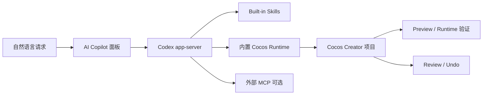

<p align="center">
  
</p>

<p align="center">
  简体中文 ｜ <a href="README.en.md">English</a>
</p>

<h1 align="center">Cocos AI Copilot</h1>

<p align="center">
  在 Cocos Creator 内，用自然语言驱动场景、资源与 Preview / Runtime 验证。
</p>

<p align="center">
  
  
  
  
  
</p>

Cocos AI Copilot 是运行在 Cocos Creator 内的可停靠 AI 开发助手。它通过 Codex app-server 和扩展自带的 Cocos Runtime，把自然语言请求转成可检查的 Scene、Node、Component、资源与 Preview 操作，并将产物、执行记录、项目改动和运行证据保留在当前项目与会话中。

它不是独立游戏引擎，也不替代 Cocos Creator、版本控制或人工测试。它的目标是让 AI 真正在 Creator 项目上下文中完成工作，同时让开发者能够检查发生了什么、验证结果是否成立，并在安全条件满足时撤销改动。

## 目录

- [核心能力](#核心能力)
- [工作方式](#工作方式)
- [环境要求](#环境要求)
- [安装](#安装)
- [首次使用](#首次使用)
- [示例提示词](#示例提示词)
- [内置 Skills](#内置-skills)
- [外部 MCP](#外部-mcp)
- [发布完整性](#发布完整性)
- [已知限制](#已知限制)
- [常见问题](#常见问题)
- [文档](#文档)
- [License](#license)

## 核心能力

### 自然语言驱动 Cocos 开发

- 在 Creator 内直接描述目标，无需离开当前项目。
- 读取当前项目、Scene、Hierarchy、选中对象和资源状态。
- 根据任务调用 Cocos 工具，并返回结构化结果与操作记录。
- 支持会话保存、附件、排队消息以及 Turn 进行中的方向调整。

### Scene / Node / Component

- 检查、创建、打开和保存 Scene。
- 查找、创建、修改或删除 Node。
- 调整位置、旋转、缩放和激活状态。
- 检查、添加、移除和配置 Component 及其属性。
- 支持常见 UI、Prefab、资源引用和脚本诊断工作流。

### 图片资源工作流

- 图片生成结果和图片附件以聊天 Artifact 卡片交付。
- Artifact 随会话保存，关闭并重新打开后仍可显示。
- 按内容哈希去重，避免同一图片因后续检视重复出现。
- 支持裁剪、透明边缘处理、缩放、画布扩展、翻转、旋转、透明度与颜色调整、合成和遮罩。
- 支持 Sprite Sheet、Nine-Slice、像素画过滤、AssetDB 导入、SpriteFrame 配置和场景放置。
- 等待并确认 ImageAsset / SpriteFrame 就绪后，再继续绑定和验证。

### 音频资源工作流

- 音频结果以聊天 Artifact 卡片呈现并可试听。
- 支持 WAV、MP3、OGG 的裁切、淡入淡出、增益、归一化、声道和采样率调整。
- 支持保存处理版本、导入 AudioClip、创建或配置 AudioSource。
- 可在 Preview 中检查 Clip、音量、循环和自动播放配置。

### Preview / Runtime 验证

- 启动或复用 Cocos Creator Preview。
- 向当前 Game View Preview 发送会话绑定的键盘、鼠标和触摸输入。
- 读取运行时节点、组件、游戏状态或可见文本等语义结果。
- 在视觉结果重要时获取 Preview 截图作为辅助证据。

### Runtime Error Capture

- 捕获当前 Game View Preview 会话中的 `console.error`。
- 捕获未处理 Promise rejection 和未捕获异常。
- 保留错误消息、堆栈、来源文件、行列位置、重复次数和 Preview 会话信息。
- 通过会话边界避免把旧 Preview 的错误误判为当前运行结果。

### Review / Undo

- 按 Turn 查看已记录的文件、资源、Scene、Node 和 Component 改动。
- 定位改动目标并检查语义化变更摘要。
- 对受支持且身份、哈希或前置条件仍匹配的改动执行 Undo。
- 遇到后续人工修改或状态冲突时明确提示，不静默覆盖新内容。

## 工作方式



典型任务流程：

1. 读取项目、场景和层级上下文。
2. 明确目标、限制以及验收方式。
3. 执行最小范围的场景、代码或资源修改。
4. 读取修改结果，并在需要时运行 Preview。
5. 检查 Artifact、Activity、Runtime errors 和 Review。
6. 开发者确认结果；必要时使用 Undo 或版本控制恢复。

## 环境要求

| 项目 | 0.1.0 要求 |
| --- | --- |
| Cocos Creator | 已验证并正式支持 `3.8.8` |
| 操作系统 | 已验收 `Windows x64` |
| Codex | `0.160.1` 或更高稳定版，建议使用最新稳定版 |
| Codex 连接方式 | `app-server` |
| 模型服务 | ChatGPT 登录，或 OpenAI / DeepSeek API Key |

Codex 本体、模型账号和 API 凭据不包含在扩展 ZIP 中。`0.160.1` 是最低兼容和已测基线，不是固定版本；扩展允许连接更高稳定版，但这不表示每个未来版本都已逐版认证。

## 安装

### 从 GitHub Release 安装

1. 从仓库的 **Releases** 页面下载：

   ```text
   cocos-ai-copilot-0.1.0.zip
   ```

2. 关闭正在使用目标项目的 Cocos Creator。
3. 如果安装过旧版，先完整删除：

   ```text
   <项目目录>\extensions\cocos-ai-copilot
   ```

4. 解压正式 ZIP，将其中的 `extensions\cocos-ai-copilot` 放到项目对应目录。
5. 重新打开项目，通过顶部菜单 **AI Copilot** 打开面板。
6. 打开设置 → Cocos MCP → 查看详情，确认版本显示 `0.1.0`。

> [!IMPORTANT]
> 升级时不要把新文件覆盖合并到旧扩展目录。请先移除旧目录，再进行干净安装，避免残留文件导致入口或模块不一致。

### 从 Cocos 扩展市场安装

在 Cocos 扩展市场安装 **Cocos AI Copilot**，然后重新打开对应项目即可。

完整步骤见[安装说明](docs/INSTALLATION.md)。

## 首次使用

1. 打开 **AI Copilot → 设置 → Runtime**。
2. 让扩展自动发现兼容的 Codex；自动发现失败时，可手动选择 Codex 可执行程序并测试连接。
3. 在 **模型服务** 中使用 ChatGPT 登录，或配置并验证 OpenAI / DeepSeek API Key。
4. 在 **Cocos MCP** 页面确认内置 Runtime 已连接、Tools 可用，并显示 `4 / 4 Skills 已就绪`。
5. 新建会话，先请求 Copilot 读取当前 Scene / Hierarchy，再描述需要完成的改动、不可破坏的内容和验收标准。
6. 完成后检查聊天 Artifact、Preview / Runtime 证据和 Review；需要回退时再使用 Undo。

完整引导见[首次使用说明](docs/FIRST_USE.md)。

## 示例提示词

### 只读了解项目

> 读取当前场景、Hierarchy 和选中节点，概括现有 UI 结构，先不要修改任何内容。

### Scene / Component

> 在当前 Canvas 下添加一个名为 StartButton 的按钮，保持现有层级和其他节点不变。完成后读取按钮及其组件属性，并在 Game View Preview 中验证显示和点击结果。

### 图片资源

> 把本轮生成的角色图片作为聊天图片 Artifact 交付，选择最终版本导入 `assets/Art`，确认 SpriteFrame 就绪后放到当前 Canvas。不要重复登记同一张图片；最后通过 Preview 和截图验证。

### 音频资源

> 将这段背景音乐裁切到指定区间，添加淡入淡出并保存为新版本。导入项目后配置到 AudioSource，循环播放、音量 0.3，并在 Preview 中读取实际运行配置。

### Runtime 错误诊断

> 读取当前 Game View Preview 会话的 Runtime errors，按来源文件、行号、堆栈和重复次数汇总。先诊断原因，不修改项目。

## 内置 Skills

0.1.0 包含以下 Built-in Skills：

| Skill | Revision | 用途 |
| --- | ---: | --- |
| Cocos MCP Workflow | 6 | Cocos 项目检查、修改、资源与验证主流程 |
| UI Composition | 4 | Cocos UI、布局、适配、Prefab 与交互工作流 |
| 2D Image Toolkit | 2 | 图片处理、导入、SpriteFrame、切图与场景放置 |
| Preview Debug | 4 | Game View 输入、运行时验证与错误诊断 |

内置 Skills 随扩展安装到当前项目能力链中，不依赖开发机器上的临时 Skill 文件。

## 外部 MCP

设置页支持手动管理：

- 本地 stdio MCP 服务；
- 远程 HTTP MCP 服务；
- JavaScript 服务的 Node.js 自动查找与手动兜底；
- 目标应用程序、工作目录、环境变量和附加参数。

外部 MCP 的安装、授权、安全性和可用性由相应服务及用户环境负责。

## 发布完整性

Cocos AI Copilot `0.1.0` 正式包直接使用已通过第二台全新电脑真实验收的 RC 内容，没有重新构建或重新打包，仅移除文件名中的 `-rc`。

| 文件 | 大小 | SHA256 |
| --- | ---: | --- |
| `cocos-ai-copilot-0.1.0.zip` | `2,248,843 bytes` | `38121A724018D93F95CB4A0E5FC03DF6B193FF8F1CFF140E87CE22B4919B3426` |

重命名前后的文件大小和 SHA256 完全一致。

## 已知限制

- `0.1.0` 尚未对其他 Cocos Creator 版本、macOS 或 Linux 完成正式认证。
- Codex 预发布版不在当前兼容策略内；更高稳定版允许连接，但不表示已经逐版认证。
- Runtime Error Capture 以当前 Creator Game View Preview 会话为主要边界，不替代浏览器、模拟器和原生构建的全平台日志验证。
- Review / Undo 只覆盖已记录、受支持且仍满足身份与前置条件的改动，不能替代 Git 或其他版本控制。
- 自动输入、状态读取和截图只能证明相应动作与观察结果，不能替代完整人工试玩、设备兼容性测试和发布验收。
- 图片、音频和模型输出的质量、内容权利与服务可用性取决于所用模型、输入内容和外部服务，发布前仍需人工审核。
- 外部 MCP 的权限与稳定性不由本扩展保证。

## 常见问题

### Runtime 没有检测到 Codex

确认电脑已安装 `0.160.1` 或更高稳定版 Codex。在设置 → Runtime 中重新检查；如果曾保存过手动路径，可选择“恢复自动检测”，或重新选择当前 Codex 可执行程序。

### 安装后提示缺少模块或入口文件

关闭 Creator，完整删除 `<项目目录>\extensions\cocos-ai-copilot`，然后从同一正式 ZIP 重新进行干净安装。不要覆盖旧目录。

### Cocos MCP 显示正常，但当前会话没有 Cocos Tools

先在设置 → Cocos MCP 中确认 Runtime 已连接，再新建会话读取 Scene / Hierarchy。Tools / Skills 清单存在不等于旧会话已经完成 MCP 绑定。

### Preview 输入已经发送，但游戏结果没有变化

输入发送成功只证明事件已投递。应继续读取同一 Preview 会话中的节点、组件或游戏状态，并在视觉结果重要时检查截图。

### Undo 无法执行

目标可能在该 Turn 之后被人工或其他任务修改。Undo 会检查身份、哈希和前置条件；发生冲突时应检查 Review，并通过版本控制决定如何恢复。

## 文档

- [安装说明](docs/INSTALLATION.md)
- [首次使用说明](docs/FIRST_USE.md)
- [更新日志](CHANGELOG.md)
- [0.1.0 Release Notes](docs/RELEASE_NOTES_0.1.0.md)

## License

本项目使用 [MIT License](LICENSE)。第三方组件及其许可信息见 `THIRD_PARTY_NOTICES.md`。
